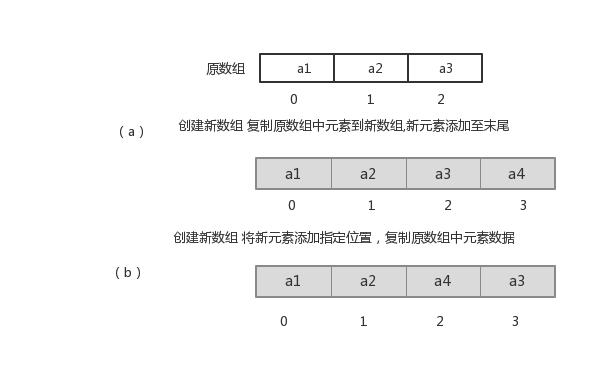
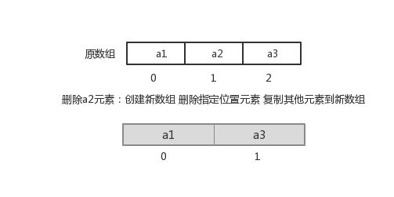

# day03 【List、Set、数据结构、Collections】

## 主要内容

- 数据结构
- List集合
- Set集合
- Collections

## 教学目标

- [ ] 能够说出List集合特点
- [ ] 能够说出常见的数据结构
- [ ] 能够说出数组结构特点
- [ ] 能够说出栈结构特点
- [ ] 能够说出队列结构特点
- [ ] 能够说出单向链表结构特点
- [ ] 能够说出Set集合的特点
- [ ] 能够说出哈希表的特点
- [ ] 使用HashSet集合存储自定义元素
- [ ] 能够说出可变参数的格式
- [ ] 能够使用集合工具类
- [ ] 能够使用Comparator比较器进行排序

# 第一章 数据结构

## 2.1 数据结构有什么用？

当你用着java里面的容器类很爽的时候，你有没有想过，怎么ArrayList就像一个无限扩充的数组，也好像链表之类的。好用吗？好用，这就是数据结构的用处，只不过你在不知不觉中使用了。

现实世界的存储，我们使用的工具和建模。每种数据结构有自己的优点和缺点，想想如果Google的数据用的是数组的存储，我们还能方便地查询到所需要的数据吗？而算法，在这么多的数据中如何做到最快的插入，查找，删除，也是在追求更快。

我们java是面向对象的语言，就好似自动档轿车，C语言好似手动档吉普。数据结构呢？是变速箱的工作原理。你完全可以不知道变速箱怎样工作，就把自动档的车子从 A点 开到 B点，而且未必就比懂得的人慢。写程序这件事，和开车一样，经验可以起到很大作用，但如果你不知道底层是怎么工作的，就永远只能开车，既不会修车，也不能造车。当然了，数据结构内容比较多，细细的学起来也是相对费功夫的，不可能达到一蹴而就。我们将常见的数据结构：堆栈、队列、数组、链表和红黑树 这几种给大家介绍一下，作为数据结构的入门，了解一下它们的特点即可。


## 2.2 常见的数据结构

数据存储的常用结构有：栈、队列、数组、链表和红黑树。我们分别来了解一下：

#### 栈

* **栈**：**stack**,又称堆栈，它是运算受限的线性表，其限制是仅允许在标的一端进行插入和删除操作，不允许在其他任何位置进行添加、查找、删除等操作。

简单的说：采用该结构的集合，对元素的存取有如下的特点

* 先进后出（即，存进去的元素，要在后它后面的元素依次取出后，才能取出该元素）。例如，子弹压进弹夹，先压进去的子弹在下面，后压进去的子弹在上面，当开枪时，先弹出上面的子弹，然后才能弹出下面的子弹。

* 栈的入口、出口的都是栈的顶端位置。

  

这里两个名词需要注意：

* **压栈**：就是存元素。即，把元素存储到栈的顶端位置，栈中已有元素依次向栈底方向移动一个位置。
* **弹栈**：就是取元素。即，把栈的顶端位置元素取出，栈中已有元素依次向栈顶方向移动一个位置。


#### 队列

* **队列**：**queue**,简称队，它同堆栈一样，也是一种运算受限的线性表，其限制是仅允许在表的一端进行插入，而在表的另一端进行删除。

简单的说，采用该结构的集合，对元素的存取有如下的特点：

* 先进先出（即，存进去的元素，要在后它前面的元素依次取出后，才能取出该元素）。例如，小火车过山洞，车头先进去，车尾后进去；车头先出来，车尾后出来。
* 队列的入口、出口各占一侧。例如，下图中的左侧为入口，右侧为出口。


#### 数组

* **数组**:**Array**,是有序的元素序列，数组是在内存中开辟一段连续的空间，并在此空间存放元素。就像是一排出租屋，有100个房间，从001到100每个房间都有固定编号，通过编号就可以快速找到租房子的人。

简单的说,采用该结构的集合，对元素的存取有如下的特点：

*  查找元素快：通过索引，可以快速访问指定位置的元素

   

*  增删元素慢
  * **指定索引位置增加元素**：需要创建一个新数组，将指定新元素存储在指定索引位置，再把原数组元素根据索引，复制到新数组对应索引的位置。如下图
  * **指定索引位置删除元素：**需要创建一个新数组，把原数组元素根据索引，复制到新数组对应索引的位置，原数组中指定索引位置元素不复制到新数组中。如下图


####  链表

* **链表**:**linked list**,由一系列结点node（链表中每一个元素称为结点）组成，结点可以在运行时i动态生成。每个结点包括两个部分：一个是存储数据元素的数据域，另一个是存储下一个结点地址的指针域。我们常说的链表结构有单向链表与双向链表，那么这里给大家介绍的是**单向链表**。

  

简单的说，采用该结构的集合，对元素的存取有如下的特点：

* 多个结点之间，通过地址进行连接。例如，多个人手拉手，每个人使用自己的右手拉住下个人的左手，依次类推，这样多个人就连在一起了。

  

* 查找元素慢：想查找某个元素，需要通过连接的节点，依次向后查找指定元素

* 增删元素快：

  *  增加元素：只需要修改连接下个元素的地址即可。

    

  *  删除元素：只需要修改连接下个元素的地址即可。

    

#### 红黑树

* **二叉树**：**binary tree** ,是每个结点不超过2的有序**树（tree）** 。

简单的理解，就是一种类似于我们生活中树的结构，只不过每个结点上都最多只能有两个子结点。

二叉树是每个节点最多有两个子树的树结构。顶上的叫根结点，两边被称作“左子树”和“右子树”。

如图：


我们要说的是二叉树的一种比较有意思的叫做**红黑树**，红黑树本身就是一颗二叉查找树，将节点插入后，该树仍然是一颗二叉查找树。也就意味着，树的键值仍然是有序的。

红黑树的约束:

1. 节点可以是红色的或者黑色的


2. 根节点是黑色的


3. 叶子节点(特指空节点)是黑色的
4. 每个红色节点的子节点都是黑色的
5. 任何一个节点到其每一个叶子节点的所有路径上黑色节点数相同

红黑树的特点:

​	速度特别快,趋近平衡树,查找叶子元素最少和最多次数不多于二倍

# 第二章 List集合

我们掌握了Collection接口的使用后，再来看看Collection接口中的子类，他们都具备那些特性呢？

接下来，我们一起学习Collection中的常用几个子类（`java.util.List`集合、`java.util.Set`集合）。

## 1.1 List接口介绍

`java.util.List`接口继承自`Collection`接口，是单列集合的一个重要分支，习惯性地会将实现了`List`接口的对象称为List集合。在List集合中允许出现重复的元素，所有的元素是以一种线性方式进行存储的，在程序中可以通过索引来访问集合中的指定元素。另外，List集合还有一个特点就是元素有序，即元素的存入顺序和取出顺序一致。

看完API，我们总结一下：

List接口特点：

1. 它是一个元素存取有序的集合。例如，存元素的顺序是11、22、33。那么集合中，元素的存储就是按照11、22、33的顺序完成的）。
2. 它是一个带有索引的集合，通过索引就可以精确的操作集合中的元素（与数组的索引是一个道理）。
3. 集合中可以有重复的元素，通过元素的equals方法，来比较是否为重复的元素。

> tips:我们在基础班的时候已经学习过List接口的子类java.util.ArrayList类，该类中的方法都是来自List中定义。

## 1.2 List接口中常用方法

List作为Collection集合的子接口，不但继承了Collection接口中的全部方法，而且还增加了一些根据元素索引来操作集合的特有方法，如下：

- `public void add(int index, E element)`: 将指定的元素，添加到该集合中的指定位置上。
- `public E get(int index)`:返回集合中指定位置的元素。
- `public E remove(int index)`: 移除列表中指定位置的元素, 返回的是被移除的元素。
- `public E set(int index, E element)`:用指定元素替换集合中指定位置的元素,返回值的更新前的元素。

List集合特有的方法都是跟索引相关，我们在基础班都学习过，那么我们再来复习一遍吧：

```java
public class ListDemo {
    public static void main(String[] args) {
		// 创建List集合对象
    	List<String> list = new ArrayList<String>();
    	
    	// 往 尾部添加 指定元素
    	list.add("图图");
    	list.add("小美");
    	list.add("不高兴");
    	
    	System.out.println(list);
    	// add(int index,String s) 往指定位置添加
    	list.add(1,"没头脑");
    	
    	System.out.println(list);
    	// String remove(int index) 删除指定位置元素  返回被删除元素
    	// 删除索引位置为2的元素 
    	System.out.println("删除索引位置为2的元素");
    	System.out.println(list.remove(2));
    	
    	System.out.println(list);
    	
    	// String set(int index,String s)
    	// 在指定位置 进行 元素替代（改） 
    	// 修改指定位置元素
    	list.set(0, "三毛");
    	System.out.println(list);
    	
    	// String get(int index)  获取指定位置元素
    	
    	// 跟size() 方法一起用  来 遍历的 
    	for(int i = 0;i<list.size();i++){
    		System.out.println(list.get(i));
    	}
    	//还可以使用增强for
    	for (String string : list) {
			System.out.println(string);
		}  	
	}
}
```

# 第三章 List的子类

## 3.1 ArrayList集合

`java.util.ArrayList`集合数据存储的结构是数组结构。元素增删慢，查找快，由于日常开发中使用最多的功能为查询数据、遍历数据，所以`ArrayList`是最常用的集合。

许多程序员开发时非常随意地使用ArrayList完成任何需求，并不严谨，这种用法是不提倡的。

## 3.2 LinkedList集合

`java.util.LinkedList`集合数据存储的结构是链表结构。方便元素添加、删除的集合。

> LinkedList是一个双向链表，那么双向链表是什么样子的呢，我们用个图了解下


实际开发中对一个集合元素的添加与删除经常涉及到首尾操作，而LinkedList提供了大量首尾操作的方法。这些方法我们作为了解即可：

* `public void addFirst(E e)`:将指定元素插入此列表的开头。
* `public void addLast(E e)`:将指定元素添加到此列表的结尾。
* `public E getFirst()`:返回此列表的第一个元素。
* `public E getLast()`:返回此列表的最后一个元素。
* `public E removeFirst()`:移除并返回此列表的第一个元素。
* `public E removeLast()`:移除并返回此列表的最后一个元素。
* `public E pop()`:从此列表所表示的堆栈处弹出一个元素。
* `public void push(E e)`:将元素推入此列表所表示的堆栈。
* `public boolean isEmpty()`：如果列表不包含元素，则返回true。

LinkedList是List的子类，List中的方法LinkedList都是可以使用，这里就不做详细介绍，我们只需要了解LinkedList的特有方法即可。在开发时，LinkedList集合也可以作为堆栈，队列的结构使用。（了解即可）

方法演示：

~~~java
public class LinkedListDemo {
    public static void main(String[] args) {
        LinkedList<String> link = new LinkedList<String>();
        //添加元素
        link.addFirst("abc1");
        link.addFirst("abc2");
        link.addFirst("abc3");
        System.out.println(link);
        // 获取元素
        System.out.println(link.getFirst());
        System.out.println(link.getLast());
        // 删除元素
        System.out.println(link.removeFirst());
        System.out.println(link.removeLast());

        while (!link.isEmpty()) { //判断集合是否为空
            System.out.println(link.pop()); //弹出集合中的栈顶元素
        }

        System.out.println(link);
    }
}
~~~

# 第四章 Set接口

`java.util.Set`接口和`java.util.List`接口一样，同样继承自`Collection`接口，它与`Collection`接口中的方法基本一致，并没有对`Collection`接口进行功能上的扩充，只是比`Collection`接口更加严格了。与`List`接口不同的是，`Set`接口中元素无序，并且都会以某种规则保证存入的元素不出现重复。

`Set`集合有多个子类，这里我们介绍其中的`java.util.HashSet`、`java.util.LinkedHashSet`这两个集合。

> tips:Set集合取出元素的方式可以采用：迭代器、增强for。

## 3.1 HashSet集合介绍

`java.util.HashSet`是`Set`接口的一个实现类，它所存储的元素是不可重复的，并且元素都是无序的(即存取顺序不一致)。`java.util.HashSet`底层的实现其实是一个`java.util.HashMap`支持，由于我们暂时还未学习，先做了解。

`HashSet`是根据对象的哈希值来确定元素在集合中的存储位置，因此具有良好的存取和查找性能。保证元素唯一性的方式依赖于：`hashCode`与`equals`方法。

我们先来使用一下Set集合存储，看下现象，再进行原理的讲解:

~~~java
public class HashSetDemo {
    public static void main(String[] args) {
        //创建 Set集合
        HashSet<String>  set = new HashSet<String>();

        //添加元素
        set.add(new String("cba"));
        set.add("abc");
        set.add("bac"); 
        set.add("cba");  
        //遍历
        for (String name : set) {
            System.out.println(name);
        }
    }
}
~~~

输出结果如下，说明集合中不能存储重复元素：

~~~
cba
abc
bac
~~~

> tips:根据结果我们发现字符串"cba"只存储了一个，也就是说重复的元素set集合不存储。

## 2.2  HashSet集合存储数据的结构（哈希表）

什么是哈希表呢？

在**JDK1.8**之前，哈希表底层采用数组+链表实现，即使用链表处理冲突，同一hash值的链表都存储在一个链表里。但是当位于一个桶中的元素较多，即hash值相等的元素较多时，通过key值依次查找的效率较低。而JDK1.8中，哈希表存储采用数组+链表+红黑树实现，当链表长度超过阈值（8）时，将链表转换为红黑树，这样大大减少了查找时间。

简单的来说，哈希表是由数组+链表+红黑树（JDK1.8增加了红黑树部分）实现的，如下图所示。

看到这张图就有人要问了，这个是怎么存储的呢？

为了方便大家的理解我们结合一个存储流程图来说明一下：


总而言之，**JDK1.8**引入红黑树大程度优化了HashMap的性能，那么对于我们来讲保证HashSet集合元素的唯一，其实就是根据对象的hashCode和equals方法来决定的。如果我们往集合中存放自定义的对象，那么保证其唯一，就必须复写hashCode和equals方法建立属于当前对象的比较方式。

## 2.3  HashSet存储自定义类型元素

给HashSet中存放自定义类型元素时，需要重写对象中的hashCode和equals方法，建立自己的比较方式，才能保证HashSet集合中的对象唯一

创建自定义Student类

~~~java
public class Student {
    private String name;
    private int age;

    public Student() {
    }

    public Student(String name, int age) {
        this.name = name;
        this.age = age;
    }

    public String getName() {
        return name;
    }

    public void setName(String name) {
        this.name = name;
    }

    public int getAge() {
        return age;
    }

    public void setAge(int age) {
        this.age = age;
    }

    @Override
    public boolean equals(Object o) {
        if (this == o)
            return true;
        if (o == null || getClass() != o.getClass())
            return false;
        Student student = (Student) o;
        return age == student.age &&
               Objects.equals(name, student.name);
    }

    @Override
    public int hashCode() {
        return Objects.hash(name, age);
    }
}
~~~

~~~java
public class HashSetDemo2 {
    public static void main(String[] args) {
        //创建集合对象   该集合中存储 Student类型对象
        HashSet<Student> stuSet = new HashSet<Student>();
        //存储 
        Student stu = new Student("于谦", 43);
        stuSet.add(stu);
        stuSet.add(new Student("郭德纲", 44));
        stuSet.add(new Student("于谦", 43));
        stuSet.add(new Student("郭麒麟", 23));
        stuSet.add(stu);

        for (Student stu2 : stuSet) {
            System.out.println(stu2);
        }
    }
}
执行结果：
Student [name=郭德纲, age=44]
Student [name=于谦, age=43]
Student [name=郭麒麟, age=23]
~~~

## 2.3 LinkedHashSet

我们知道HashSet保证元素唯一，可是元素存放进去是没有顺序的，那么我们要保证有序，怎么办呢？

在HashSet下面有一个子类`java.util.LinkedHashSet`，它是链表和哈希表组合的一个数据存储结构。

演示代码如下:

~~~java
public class LinkedHashSetDemo {
	public static void main(String[] args) {
		Set<String> set = new LinkedHashSet<String>();
		set.add("bbb");
		set.add("aaa");
		set.add("abc");
		set.add("bbc");
        Iterator<String> it = set.iterator();
		while (it.hasNext()) {
			System.out.println(it.next());
		}
	}
}
结果：
  bbb
  aaa
  abc
  bbc
~~~

## 1.9  可变参数

在**JDK1.5**之后，如果我们定义一个方法需要接受多个参数，并且多个参数类型一致，我们可以对其简化成如下格式：

```
修饰符 返回值类型 方法名(参数类型... 形参名){  }
```

其实这个书写完全等价与

```
修饰符 返回值类型 方法名(参数类型[] 形参名){  }
```

只是后面这种定义，在调用时必须传递数组，而前者可以直接传递数据即可。

**JDK1.5**以后。出现了简化操作。**...** 用在参数上，称之为可变参数。

同样是代表数组，但是在调用这个带有可变参数的方法时，不用创建数组(这就是简单之处)，直接将数组中的元素作为实际参数进行传递，其实编译成的class文件，将这些元素先封装到一个数组中，在进行传递。这些动作都在编译.class文件时，自动完成了。

代码演示：    

```java
public class ChangeArgs {
    public static void main(String[] args) {
        int[] arr = { 1, 4, 62, 431, 2 };
        int sum = getSum(arr);
        System.out.println(sum);
        //  6  7  2 12 2121
        // 求 这几个元素和 6  7  2 12 2121
        int sum2 = getSum(6, 7, 2, 12, 2121);
        System.out.println(sum2);
    }

    /*
     * 完成数组  所有元素的求和 原始写法
     
      public static int getSum(int[] arr){
        int sum = 0;
        for(int a : arr){
            sum += a;
        }
        
        return sum;
      }
    */
    //可变参数写法
    public static int getSum(int... arr) {
        int sum = 0;
        for (int a : arr) {
            sum += a;
        }
        return sum;
    }
}
```

> tips: 上述add方法在同一个类中，只能存在一个。因为会发生调用的不确定性
>
> 注意：如果在方法书写时，这个方法拥有多参数，参数中包含可变参数，可变参数一定要写在参数列表的末尾位置。


# 第五章  Collections

## 2.1 常用功能

* `java.utils.Collections`是集合工具类，用来对集合进行操作。部分方法如下：

- `public static <T> boolean addAll(Collection<T> c, T... elements)  `:往集合中添加一些元素。
- `public static void shuffle(List<?> list) 打乱顺序`:打乱集合顺序。
- `public static <T> void sort(List<T> list)`:将集合中元素按照默认规则排序。
- `public static <T> void sort(List<T> list，Comparator<? super T> )`:将集合中元素按照指定规则排序。

代码演示：

```java
public class CollectionsDemo {
    public static void main(String[] args) {
        ArrayList<Integer> list = new ArrayList<Integer>();
        //原来写法
        //list.add(12);
        //list.add(14);
        //list.add(15);
        //list.add(1000);
        //采用工具类 完成 往集合中添加元素  
        Collections.addAll(list, 5, 222, 1，2);
        System.out.println(list);
        //排序方法 
        Collections.sort(list);
        System.out.println(list);
    }
}
结果：
[5, 222, 1, 2]
[1, 2, 5, 222]
```

代码演示之后 ，发现我们的集合按照顺序进行了排列，可是这样的顺序是采用默认的顺序，如果想要指定顺序那该怎么办呢？

我们发现还有个方法没有讲，`public static <T> void sort(List<T> list，Comparator<? super T> )`:将集合中元素按照指定规则排序。接下来讲解一下指定规则的排列。

## 2.2 Comparator比较器

我们还是先研究这个方法

`public static <T> void sort(List<T> list)`:将集合中元素按照默认规则排序。

不过这次存储的是字符串类型。

```java
public class CollectionsDemo2 {
    public static void main(String[] args) {
        ArrayList<String>  list = new ArrayList<String>();
        list.add("cba");
        list.add("aba");
        list.add("sba");
        list.add("nba");
        //排序方法
        Collections.sort(list);
        System.out.println(list);
    }
}
```

结果：

```
[aba, cba, nba, sba]
```

我们使用的是默认的规则完成字符串的排序，那么默认规则是怎么定义出来的呢？

说到排序了，简单的说就是两个对象之间比较大小，那么在JAVA中提供了两种比较实现的方式，一种是比较死板的采用`java.lang.Comparable`接口去实现，一种是灵活的当我需要做排序的时候在去选择的`java.util.Comparator`接口完成。

那么我们采用的`public static <T> void sort(List<T> list)`这个方法完成的排序，实际上要求了被排序的类型需要实现Comparable接口完成比较的功能，在String类型上如下：

```java
public final class String implements java.io.Serializable, Comparable<String>, CharSequence {
```

String类实现了这个接口，并完成了比较规则的定义，但是这样就把这种规则写死了，那比如我想要字符串按照第一个字符降序排列，那么这样就要修改String的源代码，这是不可能的了，那么这个时候我们可以使用

`public static <T> void sort(List<T> list，Comparator<? super T> )`方法灵活的完成，这个里面就涉及到了Comparator这个接口，位于位于java.util包下，排序是comparator能实现的功能之一,该接口代表一个比较器，比较器具有可比性！顾名思义就是做排序的，通俗地讲需要比较两个对象谁排在前谁排在后，那么比较的方法就是：

* ` public int compare(String o1, String o2)`：比较其两个参数的顺序。

  > 两个对象比较的结果有三种：大于，等于，小于。
  >
  > 如果要按照升序排序，
  > 则o1 小于o2，返回（负数），相等返回0，01大于02返回（正数）
  > 如果要按照降序排序
  > 则o1 小于o2，返回（正数），相等返回0，01大于02返回（负数）

操作如下:

```java
public class CollectionsDemo3 {
    public static void main(String[] args) {
        ArrayList<String> list = new ArrayList<String>();
        list.add("cba");
        list.add("aba");
        list.add("sba");
        list.add("nba");
        //排序方法  按照第一个单词的降序
        Collections.sort(list, new Comparator<String>() {
            @Override
            public int compare(String o1, String o2) {
                return o2.charAt(0) - o1.charAt(0);
            }
        });
        System.out.println(list);
    }
}
```

结果如下：

```
[sba, nba, cba, aba]
```

## 2.3 简述Comparable和Comparator两个接口的区别。

**Comparable**：强行对实现它的每个类的对象进行整体排序。这种排序被称为类的自然排序，类的compareTo方法被称为它的自然比较方法。只能在类中实现compareTo()一次，不能经常修改类的代码实现自己想要的排序。实现此接口的对象列表（和数组）可以通过Collections.sort（和Arrays.sort）进行自动排序，对象可以用作有序映射中的键或有序集合中的元素，无需指定比较器。

**Comparator**强行对某个对象进行整体排序。可以将Comparator 传递给sort方法（如Collections.sort或 Arrays.sort），从而允许在排序顺序上实现精确控制。还可以使用Comparator来控制某些数据结构（如有序set或有序映射）的顺序，或者为那些没有自然顺序的对象collection提供排序。

## 2.4  练习

创建一个学生类，存储到ArrayList集合中完成指定排序操作。

Student 初始类

~~~java
public class Student{
    private String name;
    private int age;

    public Student() {
    }

    public Student(String name, int age) {
        this.name = name;
        this.age = age;
    }

    public String getName() {
        return name;
    }

    public void setName(String name) {
        this.name = name;
    }

    public int getAge() {
        return age;
    }

    public void setAge(int age) {
        this.age = age;
    }

    @Override
    public String toString() {
        return "Student{" +
               "name='" + name + '\'' +
               ", age=" + age +
               '}';
    }
}
~~~

测试类：

~~~java
public class Demo {

    public static void main(String[] args) {
        // 创建四个学生对象 存储到集合中
        ArrayList<Student> list = new ArrayList<Student>();

        list.add(new Student("rose",18));
        list.add(new Student("jack",16));
        list.add(new Student("abc",16));
        list.add(new Student("ace",17));
        list.add(new Student("mark",16));


        /*
          让学生 按照年龄排序 升序
         */
//        Collections.sort(list);//要求 该list中元素类型  必须实现比较器Comparable接口


        for (Student student : list) {
            System.out.println(student);
        }


    }
}
~~~

发现，当我们调用Collections.sort()方法的时候 程序报错了。

原因：如果想要集合中的元素完成排序，那么必须要实现比较器Comparable接口。

于是我们就完成了Student类的一个实现，如下：

~~~java
public class Student implements Comparable<Student>{
    ....
    @Override
    public int compareTo(Student o) {
        return this.age-o.age;//升序
    }
}
~~~

再次测试，代码就OK 了效果如下：

~~~java
Student{name='jack', age=16}
Student{name='abc', age=16}
Student{name='mark', age=16}
Student{name='ace', age=17}
Student{name='rose', age=18}
~~~

## 2.5 扩展

如果在使用的时候，想要独立的定义规则去使用 可以采用Collections.sort(List list,Comparetor<T> c)方式，自己定义规则：

~~~java
Collections.sort(list, new Comparator<Student>() {
    @Override
    public int compare(Student o1, Student o2) {
        return o2.getAge()-o1.getAge();//以学生的年龄降序
    }
});
~~~

效果：

~~~
Student{name='rose', age=18}
Student{name='ace', age=17}
Student{name='jack', age=16}
Student{name='abc', age=16}
Student{name='mark', age=16}
~~~


如果想要规则更多一些，可以参考下面代码：

~~~java
Collections.sort(list, new Comparator<Student>() {
            @Override
            public int compare(Student o1, Student o2) {
                // 年龄降序
                int result = o2.getAge()-o1.getAge();//年龄降序

                if(result==0){//第一个规则判断完了 下一个规则 姓名的首字母 升序
                    result = o1.getName().charAt(0)-o2.getName().charAt(0);
                }

                return result;
            }
        });
~~~

效果如下：

~~~
Student{name='rose', age=18}
Student{name='ace', age=17}
Student{name='abc', age=16}
Student{name='jack', age=16}
Student{name='mark', age=16}
~~~